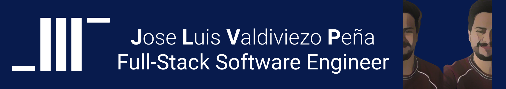

# About me !👋

  
  

  
- 👨🖥️ Currently, I am a student full-stack software Engineer at Holberton School.
- :mailbox: How to reach me: luisj.valdiviezo20@gmail.com

Here are some ideas to get you started:

- 🔭 I’m currently working on ...
- 🌱 I’m currently learning ...
- 👯 I’m looking to collaborate on ...
- 🤔 I’m looking for help with ...
- 💬 Ask me about ...
- 📫 How to reach me: ...
- 😄 Pronouns: ...
- ⚡ Fun fact: ...

# Languages, skills and tools 🧰

